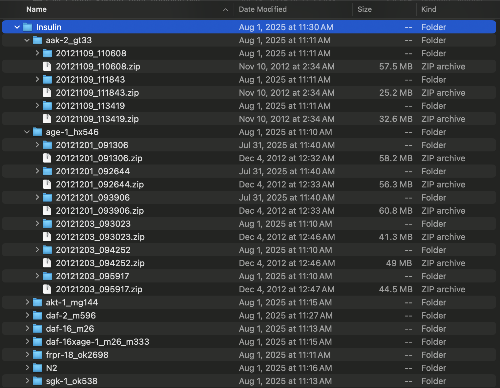
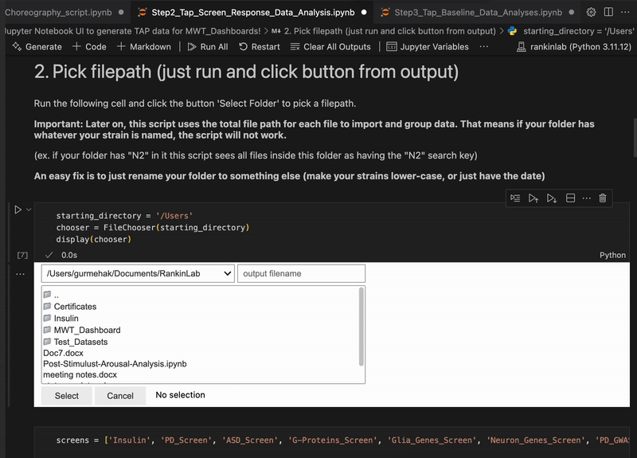
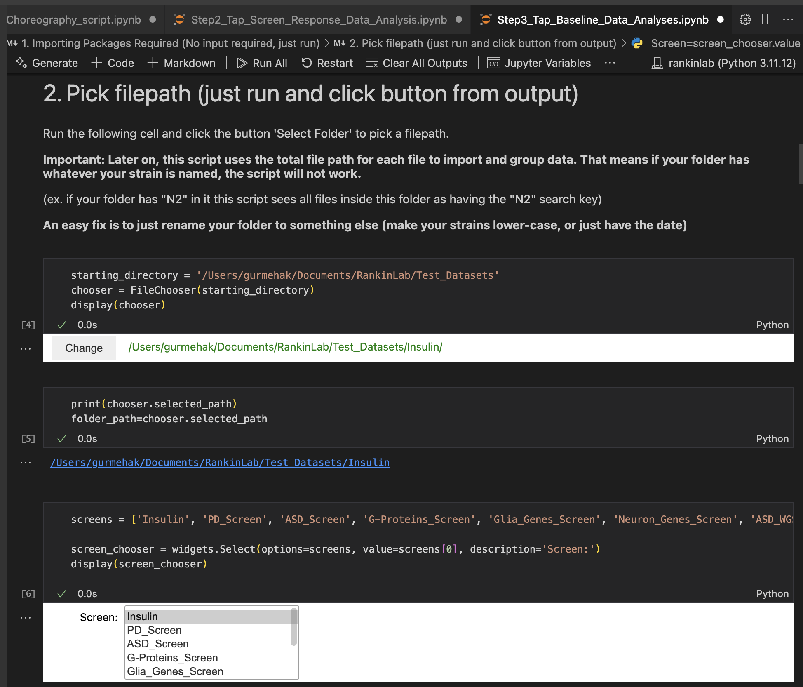
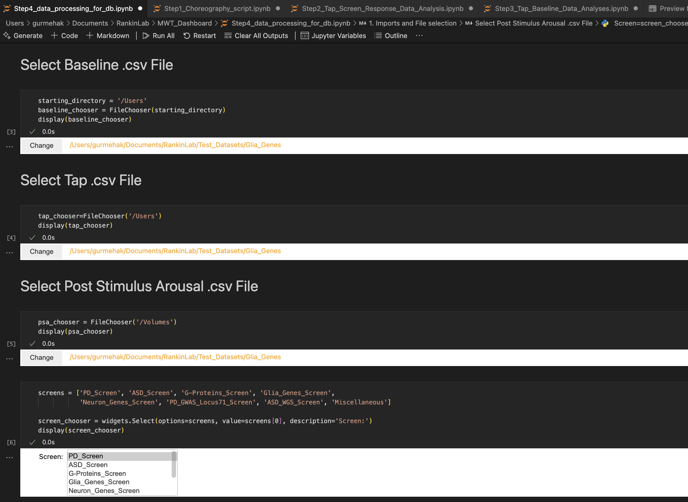

# Project Description

## Project Objective

This repository supports two connected goals:

1. standardize the processing, summarization, and storage of Multi-Worm Tracker (MWT) data, currently focused on the 10 s inter-stimulus interval (ISI) habituation paradigm
2. provide an accessible Streamlit dashboard for exploring genotype-phenotype relationships across the processed dataset

As of **March 11, 2026**, this repository is both a data-processing workspace and the source for the current MWT dashboard.

# Part 1: Data Processing and Uploading to Server

The processing workflow is organized around four Jupyter notebooks:

- `Step1_Choreography_script.ipynb`
- `Step2_Tap_Screen_Response_Data_Analysis.ipynb`
- `Step3_Tap_Baseline_Data_Analyses.ipynb`
- `Step4_data_processing_for_db.ipynb`

These notebooks are intended to be run locally in sequence. User input is limited to file selection, screen naming, and a small number of experiment-specific parameters.

## Environment Requirements

- Python 3.11 environment from `requirements.txt` or `environment.yml`
- Java SDK 8u331 for `Chore.jar`
- access to the target PostgreSQL database for the final upload step

## Step 1: Choreography Extraction

### Objective

Step 1 extracts and organizes worm movement sequences from raw MWT experiments. It runs the Java-based `Chore.jar` tool included in this repository and produces the files needed for downstream tap and baseline analysis.

### Data Sources / Inputs

Raw MWT data should be arranged by screen using a consistent directory structure:

- `screen_name/`
  - `gene_allele-1/`
    - `[plate-1].zip`
    - `[plate-2].zip`
  - `gene_allele-2/`
    - `[plate-1].zip`
    - `[plate-2].zip`



### Outputs

For each processed experiment, Step 1 generates:

- `.dat`
- `.trv`
- `.txt`

### Processing Workflow

#### 1. Read folder

- use the file chooser widget to select the raw input folder

#### 2. Run `Chore.jar`

- execute the Java-based choreography extraction step
- generate per-experiment movement output files for later notebooks

## Step 2: Tap Response Data Extraction

### Objective

Step 2 extracts tap-induced response measures from `.trv` files and standardizes them across strains and screens so they can be compared downstream.

### Data Sources / Inputs

- the screen folder processed in Step 1
- `.trv` files for each experiment
- a selected screen label such as `PD_Screen`, `Neuron_Genes_Screen`, or another configured screen category

### Output

- `tap_output`: processed CSV output containing tap-aligned response data

### Processing Workflow

#### 1. Read folder

- select the processed screen folder
- assign or confirm the screen label used for downstream grouping



#### 2. Determine tap numbers and tolerances

User-defined inputs are derived from the `.trv` files:

- `number_of_taps`: usually 30; some experiments include a 31st tap for spontaneous recovery
- `ISI`: usually 10 seconds
- `first_tap`: commonly frame 600, but should be verified from the data

The notebook then computes tolerance windows around each expected tap time. If the first tap is at frame 600, examples are:

- tap 1: `(598, 602)`
- tap 2: `(608, 612)`
- tap 3: `(618, 622)`

Later experiments may include explicit handling for tap 31.

#### 3. Process `.trv` files by strain

For each strain, the notebook:

- extracts metadata such as `Date` and `Screen`
- renames fixed-position columns to readable fields
- creates derived measures such as response probability and response speed
- assigns rows to taps using the computed timing tolerances

#### 4. Merge all dataframes

- concatenate strain-level outputs
- split genotype labels into `Gene` and `Allele`
- default missing allele labels such as wild type to `N2`
- remove invalid or empty rows

#### 5. Save as CSV

- export the merged tap-response table

## Step 3: Baseline and PSA Data Extraction

### Objective

Step 3 extracts both:

- pre-stimulus baseline behavior
- post-stimulus arousal (PSA) measurements aligned to taps

These outputs support both statistical summaries and dashboard visualizations.

### Data Sources / Inputs

- the Step 1 screen folder containing `.dat` files
- selected screen label

### Outputs

Two CSV files are generated:

1. `{Screen}_baseline_output.csv`
2. `{Screen}_post_stimulus.csv`

### Processing Workflow

#### 1. Read folder

- select the screen folder and corresponding screen name



#### 2. Define bins, tap numbers, and PSA windows

User-defined inputs include:

- `number_of_taps`
- `ISI`
- `first_tap`

The notebook computes the PSA window after each tap. The current workflow uses the post-stimulus window approximately **7.0 to 9.5 seconds** after each tap.

If the first tap occurs at 600 s, example PSA windows are:

- tap 1: `(607.0, 609.5)`
- tap 2: `(617.0, 619.5)`
- tap 3: `(627.0, 629.5)`

#### 3. Process `.dat` files by strain

For each strain, the notebook:

- extracts metadata such as `Plate_id`, `Date`, and `Screen`
- renames columns to the expected standard format
- preserves the metadata needed for grouping and later upload

#### 4. Merge all strains

- concatenate cleaned strain-level data
- extract `Gene` and `Allele` from `dataset`

#### 5. Create the baseline dataset

- filter the pre-stimulus interval, currently `490.0 <= Time <= 590.0`
- remove irrelevant columns

#### 6. Create the PSA dataset

- filter rows in the PSA windows after each tap
- group by experiment metadata and tap number
- summarize metrics such as:
  - `Speed`
  - `Bias`
  - `Angular Speed`
  - `Aspect Ratio`
  - `Kink`
  - `Curve`
  - `Crab`

The PSA output is later summarized again in Step 4 into per-strain metrics such as initial, final, peak, average, sensitization, habituation, spontaneous recovery, and memory retention.

#### 7. Save as CSV

- export baseline and post-stimulus outputs

## Step 4: Statistical Summaries and Database Export

### Objective

Step 4 merges baseline, tap, and PSA outputs into the final backend-ready data products used by the dashboard. This step performs feature engineering, statistical comparison, formatting, and upload preparation.

### Data Sources / Inputs

- baseline CSV from Step 3
- tap CSV from Step 2
- PSA CSV from Step 3
- selected screen label

### Outputs

- merged tap-response data
- baseline data
- gene-level t-stat summary data
- allele-level t-stat summary data
- gene-level MSD summary data
- allele-level MSD summary data
- summarized PSA metrics

### Processing Workflow

#### 1. Read inputs

- select the processed folder and screen label
- read baseline, tap, and PSA files



#### 2. Feature engineering on tap data

Tap-derived response metrics are summarized into features such as:

- `Initial`
- `Final`
- `Recovery`
- `Habituation`
- `Spontaneous Recovery`
- `Memory Retention`

The exact formulas depend on the metric family and whether the experiment includes tap 31.

#### 3. Summarize PSA data

PSA outputs are aggregated to one row per experiment / strain grouping. The current repository includes PSA summaries for:

- `PSA Speed`
- `PSA Bias`
- `PSA Angular Speed`
- `PSA Aspect Ratio`
- `PSA Kink`
- `PSA Curve`
- `PSA Crab`

The Step 4 workflow now supports summary columns used throughout the dashboard and backend, including:

- `Initial PSA ...`
- `Final PSA ...`
- `Peak PSA ...`
- `Peak Tap Number of PSA ...`
- `Average PSA ...`
- `Sensitization of PSA ...`
- `Habituation of PSA ...`
- `Spontaneous Recovery of PSA ...`
- `Memory Retention of PSA ...`

#### 4. Aggregate by metadata

Grouped dataframes are created for gene-level and allele-level views, preserving screen-specific grouping and metadata.

#### 5. Mean sample distance (MSD) calculation

For each phenotype:

- group by `Gene` or allele (`dataset`)
- compute mean, SEM, and 95% confidence intervals
- normalize relative to N2 controls within screen
- combine baseline, tap, and PSA-derived features

#### 6. T-stat style analysis

The dashboard backend currently uses gene-level and allele-level normalized summary tables derived from strain-vs-N2 comparisons across baseline, tap, and PSA phenotypes.

Recent repository updates also introduced support for expanded heatmap table formatting, including updated handling of t-score and corrected p-value outputs in 2026 backend changes.

#### 7. Final formatting and export

- merge baseline, tap, and PSA summaries into final backend tables
- clean column names
- reorder metadata columns to the front
- prepare outputs for PostgreSQL upload

#### 8. Database export

- upload the structured tables to PostgreSQL

Historical testing notebooks in the repository reference `database.ini`, but the active dashboard now reads credentials through Streamlit secrets rather than a checked-in config file.

# Part 2: Data Dashboard

Public app link:
[RankinLab - MWT dashboard](https://rankinlab-mwtdashboard.streamlit.app/)

## Objective

The MWT Dashboard is a Streamlit application for exploring processed MWT data through downloadable visualizations and tables. It is intended to reduce the barrier to inspecting large multi-screen datasets and to support comparison across genes, alleles, and phenotypes.

The active app entrypoint in this repository is:

- `MWT_dashboard.py`

## Authentication and Backend Access

The current app is password-gated and expects Streamlit secrets for both login and database access.

The active secrets are read from `.streamlit/secrets.toml` and include:

- `password`
- `psql_user`
- `psql_passwword`

The dashboard loads data from a PostgreSQL backend using `utils/data_loader.py`.

## Data Sources / Inputs

The dashboard reads the following backend datasets:

- `tap_output`: merged tap-response data used for response curves and selectors
- `tap_tstat_data`: gene-level normalized summary table
- `tap_tstat_allele`: allele-level normalized summary table
- `gene_MSD`: gene-level mean sample distance table
- `allele_MSD`: allele-level mean sample distance table
- `gene_profile_data`: melted gene-level profile table generated in-app from backend data
- `allele_profile_data`: melted allele-level profile table generated in-app from backend data
- `psa_output`: summarized PSA dataset
- `id_data`: WormBase / Alliance Genome identifiers used for external links

## Outputs

- interactive plots
- downloadable PNG exports
- downloadable CSV exports

## Current Dashboard Pages

The current dashboard includes the following pages:

- `Home - Getting Started`
- `Data at a Glance`
- `Gene-specific Data`
- `Allele-specific Data`
- `Custom Gene Selection`
- `Custom Allele Selection`
- `Post Stimulus Data`
- `Gene Clustering`
- `Citations`

## Functionality

### Home - Getting Started

This page provides:

- project background
- a description of the habituation dataset
- usage guidance for selecting datasets and navigating the dashboard

### Data at a Glance

Provides a quick overview of the currently selected dataset subset.

- **Single phenotype plot**
  - shows gene-level sample mean distance relative to N2 for one selected phenotype
  - includes 95% confidence intervals

- **Comprehensive heatmap**
  - displays a whole-dataset heatmap of normalized phenotype summaries across genes

- **Baseline export**
  - allows the user to trigger and download raw baseline data for the selected datasets

### Gene-specific Data

Focuses on one gene at a time.

- **Phenotypic profile**
  - normalized profile across baseline, tap, and PSA-derived metrics

- **Rank in phenotype**
  - gene-level MSD comparison across all genes for one selected phenotype
  - N2 is shown in red, the selected gene in magenta

- **Habituation curves of response**
  - tap-by-tap comparisons for core response metrics and PSA-derived summaries

- **External links**
  - links to Alliance Genome when an identifier is available

### Allele-specific Data

Focuses on one allele (`dataset`) at a time.

- **Phenotypic profile**
  - normalized phenotype profile for the selected allele

- **Rank in phenotype**
  - allele-level MSD comparison across all alleles for one selected phenotype

- **Habituation curves of response**
  - tap-by-tap comparisons between the selected allele and N2

- **External links**
  - links to Alliance Genome and WormBase / allele resources when identifiers are available

### Custom Gene Selection

Supports comparison of multiple genes against N2.

- **Comprehensive heatmap with selected genes**
  - heatmap filtered to the selected genes

- **Rank in phenotype**
  - gene-level MSD plot with selected genes highlighted

- **Habituation curves of response**
  - multi-gene tap-response comparison across selected metrics

- **Exports**
  - PNG and CSV downloads for heatmaps and summary plots

### Custom Allele Selection

Supports comparison of multiple alleles against N2.

- **Comprehensive heatmap with selected alleles**
  - heatmap filtered to selected alleles

- **Rank in phenotype**
  - allele-level MSD plot with selected alleles highlighted

- **Habituation curves of response**
  - multi-allele tap-response comparison across selected metrics

- **Exports**
  - PNG and CSV downloads for heatmaps and summary plots

### Post Stimulus Data

Provides direct access to the summarized PSA dataset.

- users can choose a PSA metric such as `Speed`, `Bias`, `Angular Speed`, `Kink`, `Crab`, `Aspect Ratio`, or `Curve`
- users can choose a summary such as `Initial`, `Final`, `Recovery`, `Peak`, `Peak Tap Number`, `Average`, `Sensitization`, `Habituation`, `Spontaneous Recovery`, or `Memory Retention`
- users can filter to selected genes
- the page renders a bar chart summarizing the chosen PSA output

### Gene Clustering

This page was added after the initial whitepaper draft and is now part of the active dashboard.

- uses the gene-level normalized summary table as input
- preprocesses numeric and categorical fields
- applies PCA, KMeans, and t-SNE
- lets the user choose the number of clusters
- renders an interactive scatterplot of clustered genes

### Citations

Lists the main MWT, screening, and online resource references used by the project.

## Deployment Notes

The repository now includes a `Dockerfile` that runs the dashboard on port `8502`.

Example usage:

```bash
docker build -t mwt-dashboard .
docker run --rm -p 8502:8502 mwt-dashboard
```

Any deployment method still requires valid Streamlit secrets for auth and database access.

## Major Changes Since the Original 2025 Whitepaper Draft

Since the first whitepaper draft in August 2025, the repository has evolved in several important ways:

- the legacy dashboard script was replaced by the current `MWT_dashboard.py` app structure
- password authentication was reimplemented through Streamlit session state
- custom gene and custom allele comparison pages were added
- PSA processing and dashboard support were significantly expanded
- the dashboard gained a clustering page
- download support was broadened across pages
- backend loading moved further toward dynamic transformation in `utils/data_loader.py`
- Docker support was added
- 2026 backend changes updated heatmap and summary-table handling

## Contact

For bugs, issues, or feature requests, contact Joseph Liang at `joseph.liang@psych.ubc.ca`.
